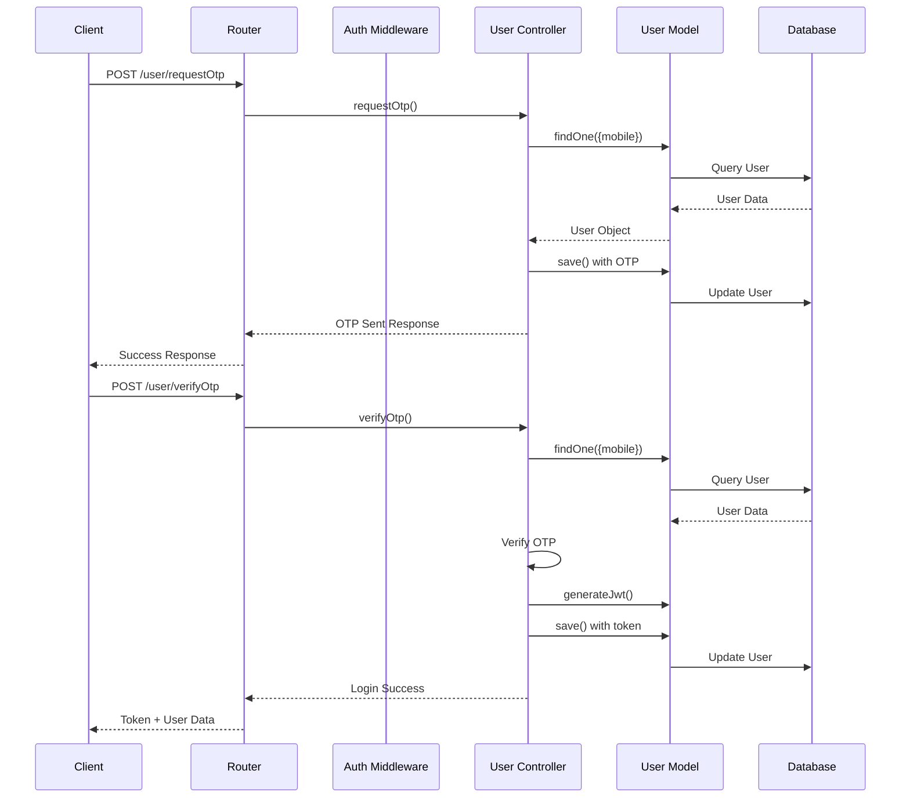
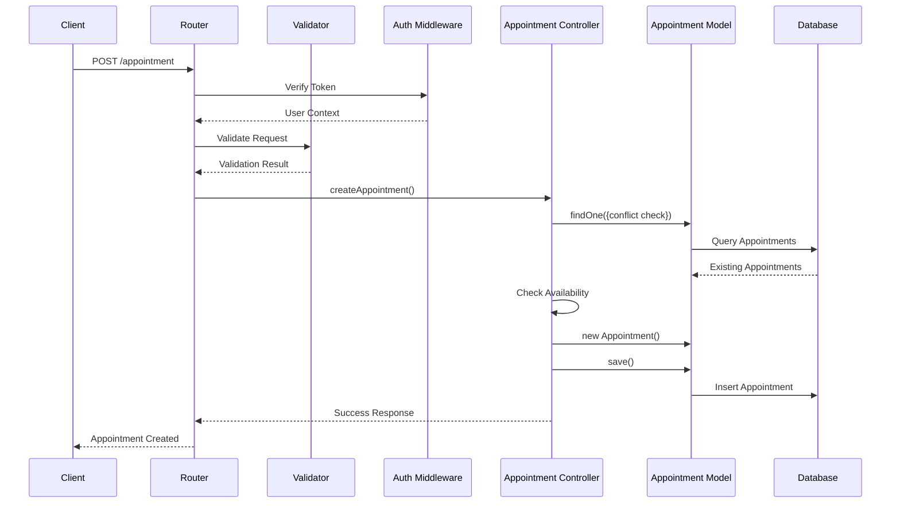
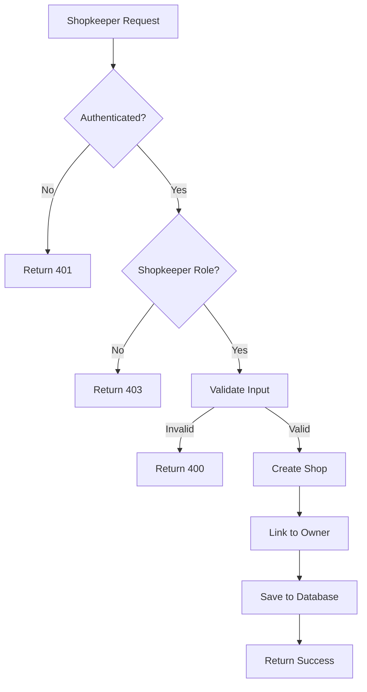
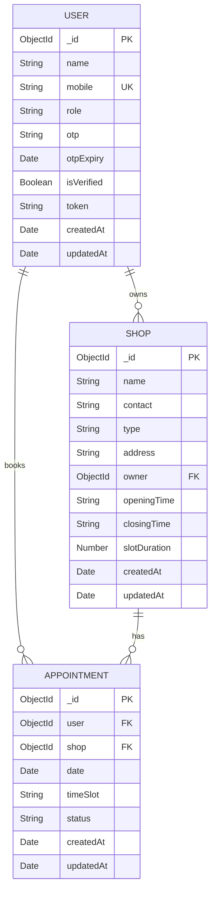
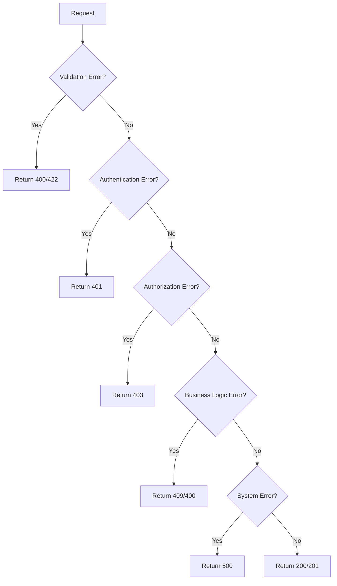

# upTime Backend - System Architecture

## 📋 Table of Contents

- [Overview](#overview)
- [System Architecture](#system-architecture)
- [Data Flow](#data-flow)
- [Security Architecture](#security-architecture)
- [Database Design](#database-design)
- [API Design Patterns](#api-design-patterns)
- [Error Handling](#error-handling)
- [Performance Considerations](#performance-considerations)
- [Scalability](#scalability)

## 🎯 Overview

The upTime Backend is a RESTful API service built with Node.js and Express.js, designed to handle appointment booking for service-based businesses. The system follows a layered architecture pattern with clear separation of concerns.

## 🏗️ System Architecture

### High-Level Architecture

```
┌─────────────────────────────────────────────────────────────────┐
│                        Client Layer                             │
├─────────────────────────────────────────────────────────────────┤
│  Mobile App  │  Web App  │  Admin Panel  │  Third-party Apps   │
└─────────────────────────────────────────────────────────────────┘
                                │
                                ▼
┌─────────────────────────────────────────────────────────────────┐
│                      API Gateway Layer                          │
├─────────────────────────────────────────────────────────────────┤
│  CORS  │  Rate Limiting  │  Request Logging  │  Health Checks   │
└─────────────────────────────────────────────────────────────────┘
                                │
                                ▼
┌─────────────────────────────────────────────────────────────────┐
│                     Application Layer                           │
├─────────────────────────────────────────────────────────────────┤
│  Authentication  │  Authorization  │  Validation  │  Business Logic │
└─────────────────────────────────────────────────────────────────┘
                                │
                                ▼
┌─────────────────────────────────────────────────────────────────┐
│                      Data Access Layer                          │
├─────────────────────────────────────────────────────────────────┤
│  Mongoose ODM  │  Data Models  │  Query Optimization  │  Caching │
└─────────────────────────────────────────────────────────────────┘
                                │
                                ▼
┌─────────────────────────────────────────────────────────────────┐
│                      Data Storage Layer                         │
├─────────────────────────────────────────────────────────────────┤
│  MongoDB  │  Indexes  │  Replication  │  Backup & Recovery     │
└─────────────────────────────────────────────────────────────────┘
```

### Component Architecture

```
┌─────────────────────────────────────────────────────────────────┐
│                        upTime Backend                          │
├─────────────────────────────────────────────────────────────────┤
│                                                                 │
│  ┌─────────────────┐    ┌─────────────────┐    ┌─────────────┐  │
│  │   Controllers   │    │   Middleware    │    │   Models    │  │
│  │                 │    │                 │    │             │  │
│  │ • UserCtrl      │◄──►│ • Auth          │◄──►│ • User      │  │
│  │ • ShopCtrl      │    │ • Validation    │    │ • Shop      │  │
│  │ • AppointmentCtrl│   │ • Role-based    │    │ • Appointment│  │
│  └─────────────────┘    └─────────────────┘    └─────────────┘  │
│           │                       │                       │     │
│           ▼                       ▼                       ▼     │
│  ┌─────────────────┐    ┌─────────────────┐    ┌─────────────┐  │
│  │     Routes      │    │   Validators    │    │   Database  │  │
│  │                 │    │                 │    │             │  │
│  │ • User Routes   │    │ • Shop Validator│    │ • MongoDB   │  │
│  │ • Shop Routes   │    │ • Appointment   │    │ • Mongoose  │  │
│  │ • Appointment   │    │   Validator     │    │ • Connection│  │
│  └─────────────────┘    └─────────────────┘    └─────────────┘  │
│                                                                 │
└─────────────────────────────────────────────────────────────────┘
```

## 🔄 Data Flow

### Authentication Flow



### Appointment Booking Flow



### Shop Management Flow



## 🔐 Security Architecture

### Authentication & Authorization

```
┌─────────────────────────────────────────────────────────────────┐
│                    Security Layers                              │
├─────────────────────────────────────────────────────────────────┤
│                                                                 │
│  ┌─────────────────┐    ┌─────────────────┐    ┌─────────────┐  │
│  │   OTP Layer     │    │   JWT Layer     │    │  Role Layer │  │
│  │                 │    │                 │    │             │  │
│  │ • Mobile Verify │    │ • Token Gen     │    │ • User      │  │
│  │ • OTP Expiry    │    │ • Token Verify  │    │ • Shopkeeper│  │
│  │ • Rate Limiting │    │ • Session Mgmt  │    │ • Admin     │  │
│  └─────────────────┘    └─────────────────┘    └─────────────┘  │
│           │                       │                       │     │
│           ▼                       ▼                       ▼     │
│  ┌─────────────────┐    ┌─────────────────┐    ┌─────────────┐  │
│  │   Validation    │    │   Middleware    │    │   Access    │  │
│  │                 │    │                 │    │  Control    │  │
│  │ • Input Sanitize│    │ • Auth Check    │    │ • Endpoint  │  │
│  │ • Schema Valid  │    │ • Role Check    │    │ • Token Refresh │  │
│  │ • SQL Injection │    │ • Token Refresh │    │ • Resource  │  │
│  └─────────────────┘    └─────────────────┘    └─────────────┘  │
│                                                                 │
└─────────────────────────────────────────────────────────────────┘
```

### Security Features

1. **OTP Authentication**
   - Time-based OTP with 5-minute expiry
   - Mobile number verification
   - Rate limiting on OTP requests

2. **JWT Token Management**
   - 7-day token expiration
   - Token invalidation on logout
   - Secure token storage

3. **Role-Based Access Control**
   - User: Can book appointments
   - Shopkeeper: Can manage shops and appointments
   - Admin: Full system access

4. **Input Validation**
   - Request body validation
   - Data type checking
   - SQL injection prevention

## 🗄️ Database Design

### Entity Relationship Diagram



### Database Indexes

```javascript
// User Collection Indexes
{
  "mobile": 1,           // Unique index for mobile number
  "role": 1,             // Index for role-based queries
  "isVerified": 1        // Index for verification status
}

// Shop Collection Indexes
{
  "owner": 1,            // Index for owner-based queries
  "type": 1,             // Index for shop type filtering
  "name": "text",        // Text index for search
  "type": "text"         // Text index for search
}

// Appointment Collection Indexes
{
  "shop": 1,             // Index for shop-based queries
  "user": 1,             // Index for user-based queries
  "date": 1,             // Index for date-based queries
  "status": 1,           // Index for status filtering
  "shop": 1,             // Compound index for conflict checking
  "date": 1,
  "timeSlot": 1,
  "status": 1
}
```

### Data Consistency Rules

1. **Referential Integrity**
   - Shop owner must exist in User collection
   - Appointment user must exist in User collection
   - Appointment shop must exist in Shop collection

2. **Business Rules**
   - Only verified users can book appointments
   - Only shopkeepers can create shops
   - Time slots cannot be double-booked
   - Past appointments cannot be modified

3. **Data Validation**
   - Mobile numbers must be unique
   - Shop types must be predefined values
   - Appointment status must be valid enum values

## 🎨 API Design Patterns

### RESTful Design Principles

1. **Resource-Based URLs**
   ```
   GET    /api/v1/user          # List users
   POST   /api/v1/user          # Create user
   GET    /api/v1/user/:id      # Get specific user
   PUT    /api/v1/user/:id      # Update user
   DELETE /api/v1/user/:id      # Delete user
   ```

2. **HTTP Status Codes**
   - `200`: Success
   - `201`: Created
   - `400`: Bad Request
   - `401`: Unauthorized
   - `403`: Forbidden
   - `404`: Not Found
   - `409`: Conflict
   - `500`: Server Error

3. **Consistent Response Format**
   ```json
   {
     "message": "Operation description",
     "data": { ... },
     "pagination": {
       "page": 1,
       "limit": 10,
       "total": 100
     }
   }
   ```

### Middleware Pattern

```javascript
// Request Flow
Client Request
    ↓
CORS Middleware
    ↓
Body Parser
    ↓
Authentication Middleware
    ↓
Authorization Middleware
    ↓
Validation Middleware
    ↓
Controller
    ↓
Response
```

## ⚠️ Error Handling

### Error Handling Strategy



### Error Response Format

```json
{
  "message": "Error description",
  "error": "Detailed error message",
  "code": "ERROR_CODE",
  "timestamp": "2024-01-15T10:00:00.000Z"
}
```

### Error Categories

1. **Validation Errors (400/422)**
   - Invalid input data
   - Missing required fields
   - Data type mismatches

2. **Authentication Errors (401)**
   - Missing token
   - Invalid token
   - Expired token

3. **Authorization Errors (403)**
   - Insufficient permissions
   - Role-based access denied

4. **Business Logic Errors (409)**
   - Time slot conflicts
   - Resource conflicts
   - Business rule violations

5. **System Errors (500)**
   - Database connection issues
   - External service failures
   - Unexpected exceptions

## ⚡ Performance Considerations

### Optimization Strategies

1. **Database Optimization**
   - Proper indexing on frequently queried fields
   - Query optimization with Mongoose
   - Connection pooling
   - Read replicas for read-heavy operations

2. **Caching Strategy**
   ```javascript
   // Redis caching for frequently accessed data
   const cacheKey = `shop:${shopId}`;
   const cachedShop = await redis.get(cacheKey);
   if (cachedShop) {
     return JSON.parse(cachedShop);
   }
   ```

3. **Pagination**
   - Limit result sets
   - Efficient skip/limit queries
   - Cursor-based pagination for large datasets

4. **Response Optimization**
   - Selective field projection
   - Population optimization
   - Response compression

### Performance Monitoring

```javascript
// Request timing middleware
app.use((req, res, next) => {
  const start = Date.now();
  res.on('finish', () => {
    const duration = Date.now() - start;
    console.log(`${req.method} ${req.path} - ${duration}ms`);
  });
  next();
});
```

## 📈 Scalability

### Horizontal Scaling

```
┌─────────────────────────────────────────────────────────────────┐
│                    Load Balancer                                │
├─────────────────────────────────────────────────────────────────┤
│                                                                 │
│  ┌─────────────┐  ┌─────────────┐  ┌─────────────┐            │
│  │   Server 1  │  │   Server 2  │  │   Server 3  │            │
│  │             │  │             │  │             │            │
│  │ • API       │  │ • API       │  │ • API       │            │
│  │ • Auth      │  │ • Auth      │  │ • Auth      │            │
│  │ • Business  │  │ • Business  │  │ • Business  │            │
│  │   Logic     │  │   Logic     │  │   Logic     │            │
│  └─────────────┘  └─────────────┘  └─────────────┘            │
│                                                                 │
└─────────────────────────────────────────────────────────────────┘
                                │
                                ▼
┌─────────────────────────────────────────────────────────────────┐
│                    Shared Services                              │
├─────────────────────────────────────────────────────────────────┤
│  MongoDB Cluster  │  Redis Cache  │  File Storage  │  Logging  │
└─────────────────────────────────────────────────────────────────┘
```

### Microservices Architecture (Future)

```
┌─────────────────────────────────────────────────────────────────┐
│                    API Gateway                                  │
├─────────────────────────────────────────────────────────────────┤
│                                                                 │
│  ┌─────────────┐  ┌─────────────┐  ┌─────────────┐            │
│  │   Auth      │  │   Shop      │  │ Appointment │            │
│  │  Service    │  │  Service    │  │  Service    │            │
│  │             │  │             │  │             │            │
│  │ • OTP       │  │ • CRUD      │  │ • Booking   │            │
│  │ • JWT       │  │ • Search    │  │ • Status    │            │
│  │ • Users     │  │ • Filter    │  │ • Conflict  │            │
│  └─────────────┘  └─────────────┘  └─────────────┘            │
│                                                                 │
└─────────────────────────────────────────────────────────────────┘
```

### Scaling Considerations

1. **Database Scaling**
   - MongoDB sharding for large datasets
   - Read replicas for read-heavy workloads
   - Connection pooling optimization

2. **Application Scaling**
   - Stateless application design
   - Session management with Redis
   - Horizontal scaling with load balancers

3. **Caching Strategy**
   - Redis for session storage
   - CDN for static assets
   - Application-level caching

4. **Monitoring & Alerting**
   - Performance metrics
   - Error tracking
   - Resource utilization
   - Business metrics

---

**Last Updated**: January 2024  
**Architecture Version**: 1.0.0  
**Documentation Version**: 1.0.0 